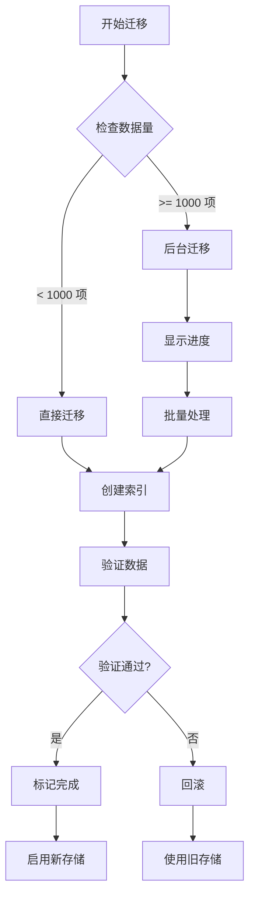

# UnclutterPlus 存储架构重构实施方案

## 📊 现状分析

### 现有架构 vs 目标架构

| 维度 | 现有实现 | 目标架构 | 差距分析 |
|------|---------|---------|---------|
| **存储模式** | 单一 JSON 文件 | 分层混合存储 | 需要引入索引层和缓存层 |
| **数据加载** | 全量加载到内存 | 索引预加载 + 按需加载内容 | 需要分离索引和内容 |
| **I/O 模式** | 主线程同步（Notes）<br>后台异步（Clipboard） | 全异步 I/O | Notes 需要异步化 |
| **搜索实现** | 内存遍历过滤 | SQLite FTS5 全文搜索 | 需要构建索引数据库 |
| **缓存策略** | 无（全内存） | LRU 多级缓存 | 需要实现缓存系统 |
| **数据组织** | 单文件存储 | 分片/分月存储 | 需要重组目录结构 |

---

## 🗺️ 渐进式重构路线图

### Phase 0: 基础准备（1-2 天）
**目标**: 搭建基础设施，不影响现有功能

```swift
// 1. 创建核心抽象层
protocol StorageProtocol {
    associatedtype Item: Codable
    func save(_ items: [Item]) async throws
    func load() async throws -> [Item]
    func search(query: String) async throws -> [Item]
}

// 2. 创建存储配置
struct StorageConfiguration {
    let baseURL: URL
    let cacheSize: Int
    let indexType: IndexType
    let compressionEnabled: Bool
}

// 3. 添加性能监控基础
extension PerformanceMonitor {
    static func measureStorage<T>(_ label: String, _ operation: () async throws -> T) async rethrows -> T
}
```

### Phase 1: 数据访问层抽象（3-5 天）
**目标**: 在现有实现上包装统一的数据访问接口

```swift
// ============ Step 1: 创建 Repository 层 ============

// Core/Storage/Repository/NoteRepository.swift
@MainActor
class NoteRepository: ObservableObject {
    @Published private(set) var notes: [Note] = []

    private let legacyManager = NotesManager.shared  // 暂时保留旧实现
    private let newStorage: NoteStorageProtocol?     // 新实现（可选）

    var isUsingNewStorage: Bool {
        UserDefaults.standard.bool(forKey: "feature.newStorage.enabled")
    }

    func loadNotes() async {
        if isUsingNewStorage, let storage = newStorage {
            // 新存储实现
            self.notes = await storage.loadAll()
        } else {
            // 旧实现
            self.notes = legacyManager.notes
        }
    }

    func saveNote(_ note: Note) async {
        if isUsingNewStorage, let storage = newStorage {
            await storage.save(note)
        } else {
            legacyManager.updateNote(note)
        }
    }
}

// ============ Step 2: 迁移 ViewModel ============

// Before
class NotesViewModel: ObservableObject {
    private let notesManager = NotesManager.shared

    func saveNote() {
        notesManager.updateNote(currentNote)
    }
}

// After
class NotesViewModel: ObservableObject {
    private let repository = NoteRepository()

    func saveNote() {
        Task {
            await repository.saveNote(currentNote)
        }
    }
}
```

---

### Phase 2: 索引层实现（1 周）
**目标**: 构建 SQLite 索引，双写模式运行

```swift
// ============ Step 1: 创建索引数据库 ============

// Core/Storage/Index/IndexDatabase.swift
import SQLite3

class IndexDatabase {
    private let db: OpaquePointer?

    init() throws {
        let dbPath = ConfigurationManager.shared.notesStoragePath
            .appendingPathComponent("index.db")

        // 打开数据库
        sqlite3_open_v2(dbPath.path, &db,
                       SQLITE_OPEN_CREATE | SQLITE_OPEN_READWRITE, nil)

        // 创建表
        try createTables()
    }

    private func createTables() throws {
        let createNoteIndex = """
            CREATE TABLE IF NOT EXISTS note_index (
                id TEXT PRIMARY KEY,
                title TEXT NOT NULL,
                created_at INTEGER NOT NULL,
                modified_at INTEGER NOT NULL,
                tags TEXT,
                is_favorite INTEGER DEFAULT 0,
                word_count INTEGER DEFAULT 0,
                preview TEXT,
                content_hash TEXT
            );

            CREATE VIRTUAL TABLE IF NOT EXISTS note_fts USING fts5(
                title, preview, content,
                content=note_index,
                content_rowid=rowid
            );

            CREATE INDEX IF NOT EXISTS idx_notes_modified
                ON note_index(modified_at DESC);
            CREATE INDEX IF NOT EXISTS idx_notes_favorite
                ON note_index(is_favorite, modified_at DESC);
        """

        sqlite3_exec(db, createNoteIndex, nil, nil, nil)
    }
}

// ============ Step 2: 实现双写逻辑 ============

class HybridNoteStorage: NoteStorageProtocol {
    private let jsonStorage: LegacyJSONStorage
    private let indexDB: IndexDatabase
    private let queue = DispatchQueue(label: "storage.hybrid", qos: .utility)

    func save(_ note: Note) async {
        // 1. 保存到 JSON（保持兼容性）
        await jsonStorage.save(note)

        // 2. 异步更新索引
        await withCheckedContinuation { continuation in
            queue.async {
                self.indexDB.upsertNoteIndex(note.toIndex())
                continuation.resume()
            }
        }
    }

    func search(query: String) async -> [NoteIndex] {
        // 如果索引可用，使用索引搜索
        if indexDB.isReady {
            return await indexDB.searchNotes(query: query)
        } else {
            // 降级到内存搜索
            return await jsonStorage.searchInMemory(query: query)
        }
    }
}

// ============ Step 3: 索引迁移任务 ============

class IndexMigration {
    static func migrateExistingData() async {
        let notes = NotesManager.shared.notes
        let indexDB = try? IndexDatabase()

        await withTaskGroup(of: Void.self) { group in
            for note in notes {
                group.addTask {
                    await indexDB?.insertNoteIndex(note.toIndex())
                }
            }
        }

        print("✅ 索引迁移完成: \(notes.count) 个笔记")
    }
}
```

---

### Phase 3: 缓存层实现（3-4 天）
**目标**: 添加多级缓存，优化读取性能

```swift
// ============ Step 1: LRU 缓存实现 ============

// Core/Storage/Cache/LRUCache.swift
actor LRUCache<Key: Hashable, Value> {
    private var cache: [Key: Node] = [:]
    private var head: Node?
    private var tail: Node?
    private let maxSize: Int
    private var currentSize = 0

    // 双向链表节点
    private class Node {
        var key: Key
        var value: Value
        var prev: Node?
        var next: Node?

        init(key: Key, value: Value) {
            self.key = key
            self.value = value
        }
    }

    init(maxSize: Int) {
        self.maxSize = maxSize
    }

    func get(_ key: Key) -> Value? {
        guard let node = cache[key] else { return nil }

        // 移到头部（最近使用）
        moveToHead(node)
        return node.value
    }

    func set(_ key: Key, _ value: Value) {
        if let existing = cache[key] {
            // 更新现有节点
            existing.value = value
            moveToHead(existing)
        } else {
            // 创建新节点
            let node = Node(key: key, value: value)
            cache[key] = node
            addToHead(node)
            currentSize += 1

            // 超过大小限制，移除尾部
            if currentSize > maxSize {
                removeTail()
            }
        }
    }
}

// ============ Step 2: 分层缓存管理器 ============

class CacheManager {
    // 一级缓存：最近访问的完整对象
    private let l1Cache = LRUCache<UUID, Note>(maxSize: 10)

    // 二级缓存：索引信息
    private let l2Cache = LRUCache<UUID, NoteIndex>(maxSize: 100)

    // 三级缓存：搜索结果
    private let searchCache = LRUCache<String, [NoteIndex]>(maxSize: 50)

    func getNote(id: UUID) async -> Note? {
        // L1: 检查完整对象缓存
        if let cached = await l1Cache.get(id) {
            PerformanceMonitor.cacheHit("L1")
            return cached
        }

        // L2: 检查索引缓存
        if let index = await l2Cache.get(id) {
            PerformanceMonitor.cacheHit("L2")
            // 只加载内容部分
            if let content = await loadContent(id: id) {
                let note = Note(index: index, content: content)
                await l1Cache.set(id, note)
                return note
            }
        }

        // L3: 从存储加载
        PerformanceMonitor.cacheMiss()
        return await loadFromStorage(id: id)
    }
}
```

---

### Phase 4: 分片存储实现（1 周）
**目标**: 将单文件存储改为分片存储

```swift
// ============ Step 1: 分片存储策略 ============

// Core/Storage/Sharding/ShardingStrategy.swift
enum ShardingStrategy {
    case byMonth        // 按月分片（剪贴板、截图）
    case byCount(Int)   // 按数量分片
    case individual     // 每个项目独立文件（笔记）
}

class ShardedStorage<T: Codable & Identifiable> {
    private let baseURL: URL
    private let strategy: ShardingStrategy

    func shardPath(for item: T, date: Date = Date()) -> URL {
        switch strategy {
        case .byMonth:
            let formatter = DateFormatter()
            formatter.dateFormat = "yyyy-MM"
            let monthDir = formatter.string(from: date)
            return baseURL
                .appendingPathComponent(monthDir)
                .appendingPathComponent("\(item.id).json")

        case .byCount(let size):
            let shardIndex = item.id.hashValue % size
            return baseURL
                .appendingPathComponent("shard_\(shardIndex)")
                .appendingPathComponent("\(item.id).json")

        case .individual:
            return baseURL
                .appendingPathComponent("items")
                .appendingPathComponent("\(item.id).json")
        }
    }

    func save(_ item: T) async throws {
        let path = shardPath(for: item)

        // 确保目录存在
        let directory = path.deletingLastPathComponent()
        try FileManager.default.createDirectory(
            at: directory,
            withIntermediateDirectories: true
        )

        // 保存文件
        let encoder = JSONEncoder()
        let data = try encoder.encode(item)
        try data.write(to: path, options: .atomic)
    }
}

// ============ Step 2: 迁移工具 ============

class StorageMigrator {
    static func migrateToShardedStorage() async throws {
        let progress = Progress(totalUnitCount: 100)

        // 1. 迁移笔记
        progress.becomeCurrent(withPendingUnitCount: 40)
        try await migrateNotes()

        // 2. 迁移剪贴板
        progress.becomeCurrent(withPendingUnitCount: 30)
        try await migrateClipboard()

        // 3. 验证迁移
        progress.becomeCurrent(withPendingUnitCount: 20)
        try await verifyMigration()

        // 4. 清理旧数据
        progress.becomeCurrent(withPendingUnitCount: 10)
        await cleanupOldData()
    }

    private static func migrateNotes() async throws {
        let oldPath = ConfigurationManager.shared.notesStoragePath
            .appendingPathComponent("notes.json")

        guard let data = try? Data(contentsOf: oldPath),
              let notes = try? JSONDecoder().decode([Note].self, from: data) else {
            return
        }

        let shardedStorage = ShardedStorage<Note>(
            baseURL: ConfigurationManager.shared.notesStoragePath,
            strategy: .individual
        )

        // 并行保存
        await withTaskGroup(of: Void.self) { group in
            for note in notes {
                group.addTask {
                    try? await shardedStorage.save(note)
                }
            }
        }

        print("✅ 迁移 \(notes.count) 个笔记到分片存储")
    }
}
```

---

### Phase 5: 完整切换（3-5 天）
**目标**: 切换到新架构，保留回滚能力

```swift
// ============ Step 1: 特性开关 ============

// Core/Storage/FeatureFlags.swift
struct StorageFeatureFlags {
    @AppStorage("storage.useNewArchitecture")
    static var useNewArchitecture = false

    @AppStorage("storage.useIndex")
    static var useIndex = true

    @AppStorage("storage.useCache")
    static var useCache = true

    @AppStorage("storage.useSharding")
    static var useSharding = false
}

// ============ Step 2: 存储工厂 ============

class StorageFactory {
    static func createNoteStorage() -> NoteStorageProtocol {
        if StorageFeatureFlags.useNewArchitecture {
            // 新架构
            let index = StorageFeatureFlags.useIndex ?
                try? IndexDatabase() : nil

            let cache = StorageFeatureFlags.useCache ?
                CacheManager() : nil

            let storage = StorageFeatureFlags.useSharding ?
                ShardedStorage<Note>(...) :
                LegacyJSONStorage()

            return ModernNoteStorage(
                index: index,
                cache: cache,
                storage: storage
            )
        } else {
            // 旧架构
            return LegacyNoteStorage(
                manager: NotesManager.shared
            )
        }
    }
}

// ============ Step 3: A/B 测试支持 ============

class StorageABTest {
    static func isInTestGroup() -> Bool {
        // 10% 用户进入测试组
        let userId = getUserId()
        return userId.hashValue % 10 == 0
    }

    static func enableForTestUsers() {
        if isInTestGroup() {
            StorageFeatureFlags.useNewArchitecture = true
            print("📊 用户进入存储架构 A/B 测试组")
        }
    }
}
```

---

## 📋 实施计划表

### Week 1: 基础设施
- [ ] Day 1-2: 创建抽象层和 Repository 接口
- [ ] Day 3-4: 实现特性开关系统
- [ ] Day 5: 添加性能监控和日志

### Week 2: 索引层
- [ ] Day 1-2: SQLite 索引数据库实现
- [ ] Day 3-4: 双写逻辑和数据同步
- [ ] Day 5: 索引迁移和测试

### Week 3: 缓存层
- [ ] Day 1-2: LRU 缓存实现
- [ ] Day 3: 多级缓存管理器
- [ ] Day 4-5: 集成测试和优化

### Week 4: 分片存储
- [ ] Day 1-2: 分片策略实现
- [ ] Day 3-4: 数据迁移工具
- [ ] Day 5: 验证和回滚机制

### Week 5: 切换和优化
- [ ] Day 1-2: 完整集成测试
- [ ] Day 3: A/B 测试部署
- [ ] Day 4-5: 性能调优和监控

---

## 🔄 数据迁移流程



---

## 🛡️ 风险控制

### 1. 回滚策略
```swift
class StorageRollback {
    static func rollbackToLegacy(reason: String) {
        // 1. 禁用新存储
        StorageFeatureFlags.useNewArchitecture = false

        // 2. 记录回滚原因
        Logger.critical("存储回滚: \(reason)")

        // 3. 同步数据到旧格式
        Task {
            await syncToLegacyFormat()
        }

        // 4. 通知用户
        NotificationCenter.default.post(
            name: .storageRollback,
            object: reason
        )
    }
}
```

### 2. 数据验证
```swift
class DataValidator {
    static func validateMigration() async -> MigrationResult {
        var result = MigrationResult()

        // 验证数量
        let oldCount = await countLegacyItems()
        let newCount = await countNewItems()
        result.countMatch = (oldCount == newCount)

        // 验证内容
        let sample = await sampleItems(count: 100)
        for item in sample {
            let oldItem = await loadFromLegacy(id: item.id)
            let newItem = await loadFromNew(id: item.id)
            if !compareItems(oldItem, newItem) {
                result.failures.append(item.id)
            }
        }

        // 验证搜索
        let searchResults = await validateSearch()
        result.searchAccuracy = searchResults.accuracy

        return result
    }
}
```

### 3. 性能监控
```swift
class StorageMetrics {
    static func collectMetrics() -> Metrics {
        return Metrics(
            readLatency: PerformanceMonitor.average("storage.read"),
            writeLatency: PerformanceMonitor.average("storage.write"),
            cacheHitRate: CacheManager.hitRate,
            indexQueryTime: IndexDatabase.averageQueryTime,
            storageSize: calculateStorageSize(),
            memoryUsage: getMemoryUsage()
        )
    }

    static func checkHealthy() -> Bool {
        let metrics = collectMetrics()
        return metrics.readLatency < 50 &&    // < 50ms 读取
               metrics.writeLatency < 100 &&   // < 100ms 写入
               metrics.cacheHitRate > 0.7 &&   // > 70% 缓存命中
               metrics.memoryUsage < 100_000_000  // < 100MB 内存
    }
}
```

---

## ✅ 成功标准

### 性能指标
- ✅ 笔记加载时间 < 100ms（当前 300-500ms）
- ✅ 搜索响应时间 < 50ms（当前 100-200ms）
- ✅ 内存占用 < 50MB（当前 100-200MB）
- ✅ 支持 10000+ 笔记

### 功能指标
- ✅ 100% 向后兼容
- ✅ 零数据丢失
- ✅ 支持平滑回滚
- ✅ 用户无感知迁移

### 代码质量
- ✅ 测试覆盖率 > 80%
- ✅ 完整的错误处理
- ✅ 清晰的日志记录
- ✅ 性能监控完备

---

## 🚀 快速开始

### Step 1: 创建基础结构
```bash
mkdir -p Sources/UnclutterPlus/Core/Storage/{Repository,Index,Cache,Sharding}
```

### Step 2: 实现第一个 Repository
```swift
// 从 NoteRepository 开始，这是最简单的
class NoteRepository: ObservableObject {
    // 实现代码...
}
```

### Step 3: 添加测试
```swift
// Tests/StorageTests/NoteRepositoryTests.swift
class NoteRepositoryTests: XCTestCase {
    func testSaveAndLoad() async {
        // 测试代码...
    }
}
```

---

这个重构方案的关键优势：
1. **渐进式**: 可以分阶段实施，随时停止
2. **可回滚**: 每个阶段都可以安全回滚
3. **低风险**: 通过特性开关和 A/B 测试控制风险
4. **向后兼容**: 不破坏现有功能
5. **可测试**: 每个组件独立可测试